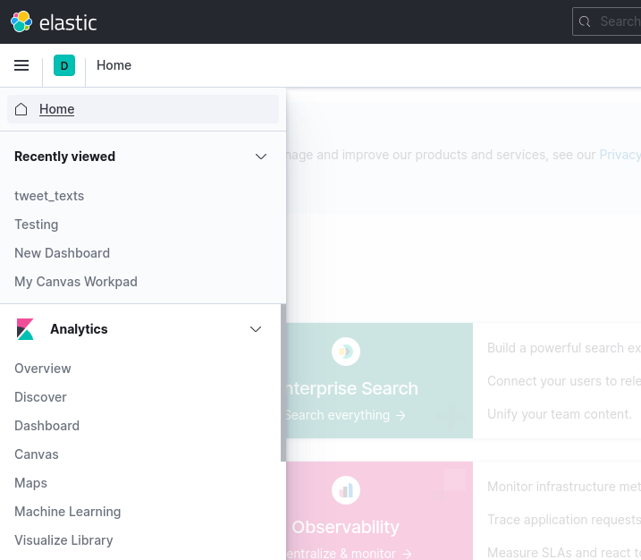
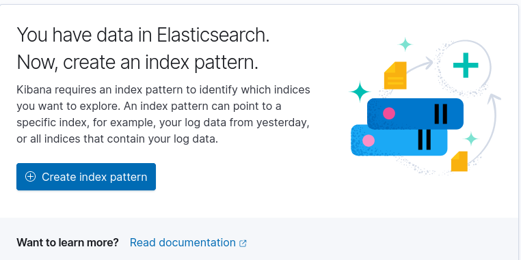
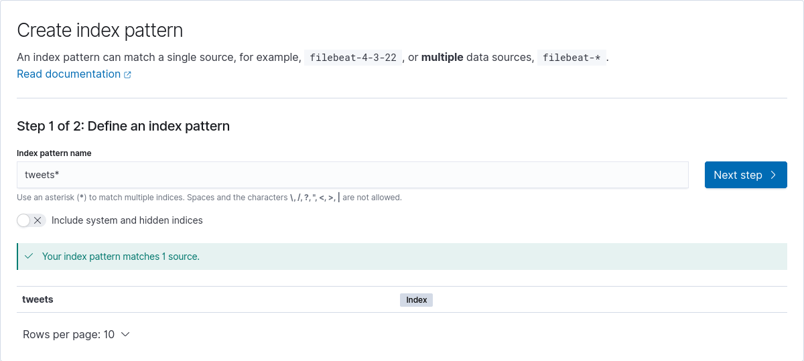
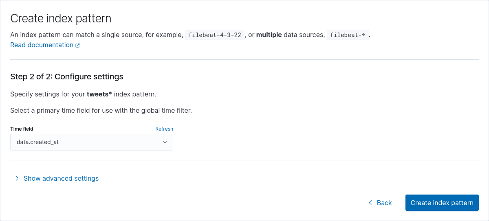

# Twitter utils

## Requirements
1. Have a Twitter developer account to access the v2 of their API, check: https://developer.twitter.com/en/docs/tutorials/stream-tweets-in-real-time.
2. Get the bearer_token from twitter developer portal and put it on an `.env` file on the repo root, eg:
```
BEARER_TOKEN=XXXXXXXXXXX
```
3. Create stream rules:
   - First compile the docker image: `docker build -t twitter_stream .`
   - Then you can run some utilities for managing your stream rules:
     - list rules: `docker run --rm twitter_stream --bearer-token XXXX list-rules`
     - create rule: `docker run --rm twitter_stream --bearer-token XXXX create-rule "your_rule_goes_here" -t some_tag`
     - delete rule: `docker run --rm -it twitter_stream --bearer-token XXXX delete-rule`
   - Rule example: "python (machine OR deep) learning -is:retweet lang:en". This rule will stream any tweet with the words "python", "machine or deep" and "learning" that are not retweets and are in english. To add this rule under a tag like "data-science" run: `docker run --rm twitter_stream --bearer-token XXXX create-rule "python (machine OR deep) learning -is:retweet lang:en" -t data-science`
   - For more info on how to create rules check: https://developer.twitter.com/en/docs/twitter-api/tweets/filtered-stream/integrate/build-a-rule.


## Streaming

Once all desired rules are setup is time to stream. The easiest way to have everything installed and running is with docker-compose installed.

But, before running docker-compose create a folder called `elasticsearch_data` as otherwise things will fail.

By running the docker-compose file 4 services will start:
- elasticsearch: An instance of Elastic Search
- zmq_publisher: Obtains data from twitter stream and publishes messages via ZeroMQ (source code in [twitter_stream/examples/zmq_publisher.rs](twitter_stream/examples/zmq_publisher.rs)).
- zmq_elasticsearch: Receives messages from the zmq_publisher and sends them to the elasticsearch instance (source code in [twitter_stream/examples/zmq_elasticsearch.rs](twitter_stream/examples/zmq_elasticsearch.rs)).
- kibana: An instance of Kibana for easy data exploration.

(If you don't want to use docker, you will need rust and cargo installed to compile the binaries in `twitter_stream` folder by running `make all`)

## Exploring

To see the state of the stream run: `docker logs twitter_utils_zmq_elasticsearch_1 -f`
To access Kibana go to http://localhost:5601 (the first time may take a couple of minutes to start), then you need to need to add the Elastic Search index in Kibana:

1. Go to "Discover" link in the side bar:



2. Click on "Create index pattern":



3. Type the index patter name: "tweets*":



4. Select the time field and click on "Create index pattern":



After this you should be able to use Kibana tools to explore the data (check "Visualize Library" on the side bar).

## Get data as JSON file

To dump Elastic Search index data to a file you can use [elasticsearch-dump](https://github.com/elasticsearch-dump/elasticsearch-dump) (install with `npm install elasticdump -g`):
```bash
elasticdump --input=http://localhost:9200/tweets --output=data.jsonl --type=data --limit=5000
``` 
> Note that this tool will give you a line-delimited JSON file

One problem with this file is that it includes Elastic Search metadata.
To extract only the tweet data (the "_source" field), we can use [jq](https://stedolan.github.io/jq/) (in ubuntu you can install with `sudo apt-get install jq`):
```bash
jq -c '._source' data.jsonl > final_data.jsonl
# or if you want a regular json file:
jq -s '[.[]._source]' data.jsonl > final_data.json
```
